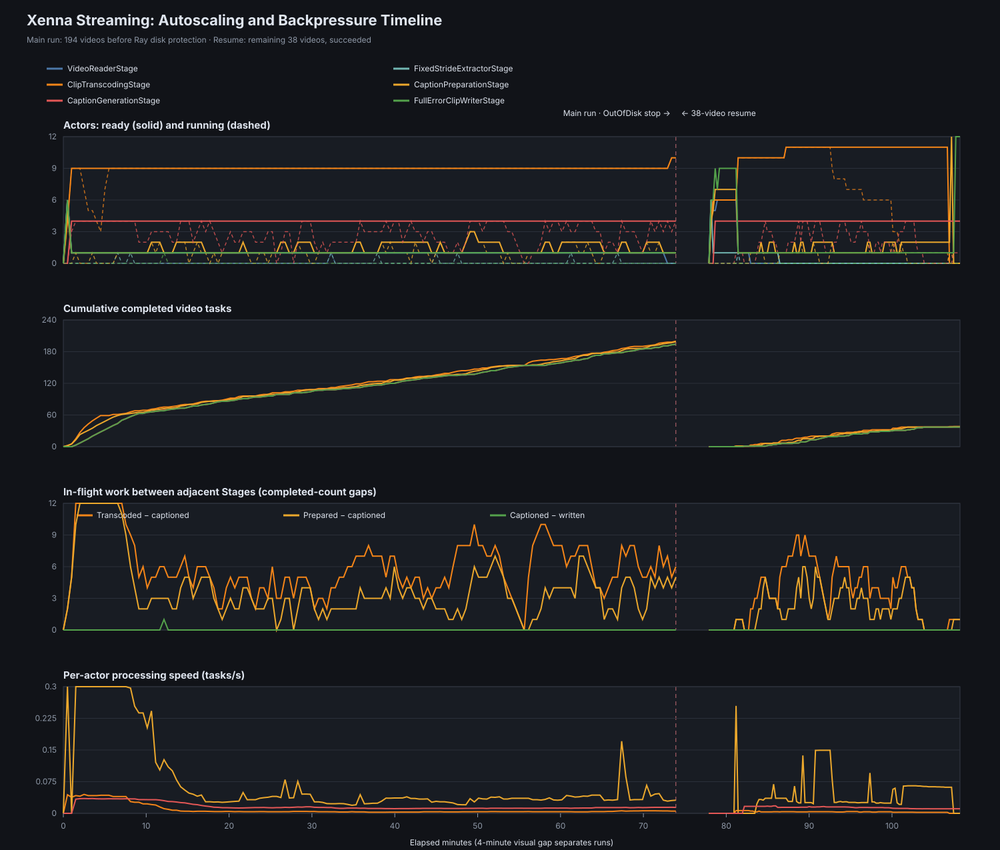

# CuratorFlow

CuratorFlow 是一个面向多模态预训练数据工程的 **NeMo Curator 实验、编排与观测项目**。媒体读取、切片、转码、Caption 等核心处理直接复用 Curator 原生 Stage；本项目负责 Pipeline 组装、Ray/Xenna 分布式执行、实验配置、运行观测、产物校验和结果展示。

项目当前已经在由 3 台 CPU ECS 与 4 台 NVIDIA L20 GPU ECS 组成的 Ray 集群上，完成一份 LLaVA-OneVision-2 视频 shard 的端到端 Streaming 实验。

## 已验证成果

| 项目 | 结果 |
| --- | ---: |
| Ray 节点 | 7（3 CPU + 4 GPU） |
| 集群资源 | 44 CPU + 4×NVIDIA L20 |
| 输入视频 | 232 |
| 输出 10 秒 Clips | 1391 |
| Clip metadata | 1391 |
| Caption windows | 1493 |
| 非空 Caption | 1493 |
| Valid Clips | 1391 |
| 缺失 MP4 / metadata errors | 0 / 0 |
| 最终输出体积 | 约 3.23 GiB |

其中一个输入视频只有 42.576 秒，因此产生 5 个 Clip；其余 231 个视频各产生 6 个 Clip：

```text
231 × 6 + 1 × 5 = 1391 clips
```

高帧率视频可能把一个 10 秒 Clip 拆成两个 Caption window，因此最终 window 数多于 Clip 数。

## Video Pipeline

```text
FilePartitioningStage
  → VideoReaderStage
  → FixedStrideExtractorStage
  → ClipTranscodingStage
  → CaptionPreparationStage
  → CaptionGenerationStage
  → ClipWriterStage
```

| Stage | 作用 | 主要资源 |
| --- | --- | --- |
| FilePartitioning | 视频目录或文件清单转换为单视频任务 | CPU |
| VideoReader | 读取完整视频字节并解析 metadata | CPU / NFS |
| FixedStrideExtractor | 计算 10 秒 Clip 时间范围 | CPU |
| ClipTranscoding | 解码源视频并重新编码为独立 VP9 Clip | CPU |
| CaptionPreparation | 解码/采样视频帧并构造模型输入 | CPU |
| CaptionGeneration | 使用 Qwen2.5-VL 生成 Caption | GPU |
| ClipWriter | 写出 MP4、Caption 和 metadata | CPU / NFS |

当前 CaptionGeneration 支持显式配置 GPU worker 数；四卡实验采用每个 worker 独占一张 GPU。CaptionPreparation 保持 CPU Stage，由 Xenna 动态调整 worker。

## 集群架构

```text
                         Ray Head / Driver
                              CPU ECS
                                 │
       ┌─────────────────────────┼─────────────────────────┐
       │                         │                         │
   CPU Workers               NFS Storage              GPU Workers
   3 × CPU ECS                CPU ECS               4 × NVIDIA L20
 Reader / Transcode       Input / Output / Logs      Qwen2.5-VL
```

关键部署约束：

- Driver 运行在 Ray Head，不要求本机有 CUDA；Preflight 检查 Ray 集群 GPU 数量。
- 输入、输出、代码和 Processor cache 通过共享存储统一访问。
- 模型权重放在每台 GPU 的本地盘，避免四个 vLLM actor 同时从 NFS mmap 权重。
- CPU Stage 使用 Xenna Streaming Autoscaling；CaptionGeneration worker 数由实验显式指定。

## 快速开始

### 开发环境

```bash
python3 -m venv .venv
source .venv/bin/activate
pip install -e '.[dev]'
make check
```

NeMo Curator 的完整视频/CUDA 环境需要 Linux。macOS 本地环境适合运行不依赖 Curator Linux runtime 的配置、报告和数据准备测试。

### 数据准备

准备一份 LLaVA-OneVision 视频 shard 样本：

```bash
make prepare-llava ARGS="\
  --download-root /data/datasets/llava-onevision-2/shard \
  --video-root /data/datasets/llava-onevision-2/videos \
  --report-path /data/datasets/llava-onevision-2/prepare-report.json \
  --max-videos 8"
```

### 四 GPU Streaming 运行

```bash
export RAY_ADDRESS=<ray-head-private-ip>:6379
export PYTHONPATH=/mnt/curator-flow/repo/src
export HF_HOME=/mnt/curator-flow/hf-cache
export HF_HUB_OFFLINE=1
export TRANSFORMERS_OFFLINE=1

python -m curator_flow.run_video_pipelines \
  --input-path /mnt/curator-flow/input \
  --output-path /mnt/curator-flow/output/<run-id> \
  --report-path /mnt/curator-flow/output/<run-id>-report.json \
  --model-dir /opt/curator-models \
  --executor xenna \
  --execution-mode streaming \
  --generate-captions \
  --caption-model qwen2.5 \
  --caption-batch-size 1 \
  --caption-max-output-tokens 256 \
  --caption-num-workers 4 \
  --xenna-logging-interval 30 \
  --xenna-autoscale-interval 60 \
  --verbose
```

也可以通过文件清单只处理指定输入，用于故障恢复或受控子集实验：

```bash
python -m curator_flow.run_video_pipelines \
  --input-path /mnt/curator-flow/input \
  --input-file-list /mnt/curator-flow/output/pending.txt \
  ...
```

清单中的每一行是原视频绝对路径，保持原路径可确保 Clip UUID 和输出相对目录稳定。

## Autoscaling 与背压

完整日志分析表明：

- VideoReader 和 FixedStride 在启动时短暂扩到 6 actors，随后缩回 1。
- ClipTranscoding 从 4 扩到 9/10 actors；恢复运行进一步扩到 11。
- CaptionPreparation 主要在 1～2 actors 间动态调整。
- CaptionGeneration 固定 4 actors，主运行平均 Running/Ready 约为 70.6%。
- Writer 单 actor 吞吐远高于 CaptionGeneration，不是稳态瓶颈。
- GPU 前在途任务最大为 31，Caption 到 Writer 最大只积压 1，Streaming 背压有效。



详细分析见 [records/5_autoscaling_and_backpressure_analysis.md](records/5_autoscaling_and_backpressure_analysis.md)。

将 Xenna 日志转换为 CSV 并重新生成图：

```bash
python scripts/parse_xenna_stage_metrics.py run.log stage-metrics.csv
python scripts/summarize_xenna_metrics.py stage-metrics.csv
python scripts/plot_xenna_autoscaling.py \
  main-stage-metrics.csv \
  resume-stage-metrics.csv \
  docs/xenna-autoscaling-backpressure.svg
```

## 性能与已知瓶颈

| 口径 | 视频/分钟 | Caption windows/分钟 |
| --- | ---: | ---: |
| 四卡主运行 | 2.607 | 16.675 |
| 38 视频恢复运行 | 1.241 | 8.230 |
| 两次有效计算合计 | 2.209 | 14.213 |
| 首次启动到最终完成的墙钟口径 | 1.722 | 11.083 |

前段低分辨率视频曾达到约 5.5 视频/分钟；后段大量 1080p、高码率视频使 CPU VP9 转码成为主要瓶颈，四张 GPU 无法长期同时满载。

主运行在 194/232 时触发 Ray `OutOfDiskError`：`/tmp/ray` 所在的 40GB 根盘跌破 5% 空闲保护线。已经写入 NFS 的结果没有丢失，随后通过精确输入清单补跑剩余 38 个视频。后续应为 Ray 临时目录与 object spill 使用独立大容量磁盘。

## Caption 质量观察

最终 1493 条 Caption 全部非空、没有完全重复，但当前参数存在明显截断风险：

```text
平均 token 数：243.5
token 中位数：256
达到 256-token 上限：1057 / 1493（70.8%）
达到上限且无正常句末：1013
全部 Caption 正常句末比例：31.6%
```

下一轮应优先收紧 Prompt，使模型输出 100～150 个英文单词、避免 Markdown 和不可见情节推断，再评估是否需要提高最大输出 token。

## 结果 Gallery

项目提供静态、分页的视频结果浏览器：

```bash
python scripts/build_results_gallery.py \
  --output-root /mnt/curator-flow \
  --run-dir /mnt/curator-flow/output/<run-id> \
  --gallery-dir /mnt/curator-flow/results-gallery
```

Gallery 特性：

- 全部 Clip 分页展示，每页 10 个；
- 按源视频路径或 Clip UUID 搜索；
- 浏览器播放视频并对照所有 Caption windows；
- 查看 metadata 和下载视频；
- Nginx Range 请求支持，可拖动视频进度。

部署模板位于：

- `web/results_gallery/index.html`
- `deploy/curator-results-gallery.nginx.conf`
- `deploy/curator-results-gallery.service`

如果从公网提供 Gallery，请只在安全组中对可信来源 IP 放行端口，并在长期使用前增加 HTTPS 与认证。

## 输出结构

```text
output/<run-id>/
├── clips/                    # 独立 MP4 Clip
├── metas/v0/                 # Clip metadata 与 Caption windows
├── processed_videos/         # 原视频级 metadata
└── processed_clip_chunks/    # Clip chunk 统计
```

Clip metadata 中包含：

- 源视频路径和时间范围；
- 输出 MP4 路径；
- 分辨率、帧率、编码信息；
- 每个 window 的帧范围和模型 Caption；
- `valid` 状态；
- Curator Stage 写入的完整 `errors` 字典。

详细契约见 [docs/data_contract.md](docs/data_contract.md)。

## 仓库结构

```text
curatorFlow/
├── src/curator_flow/       # Pipeline 组装、运行入口与 Writer 扩展
├── scripts/data/           # 数据准备脚本
├── scripts/                # Gallery、日志解析、统计与绘图工具
├── deploy/                 # Ray/ECS/Gallery 部署配置与检查脚本
├── web/                    # 结果 Gallery 前端
├── docs/                   # Pipeline、数据契约和实验图表
├── records/                # 实验环境、设计、结果和故障分析记录
└── tests/                  # 单元测试
```

## 文档导航

- [Pipeline 规划](docs/pipeline_plan.md)
- [输出数据契约](docs/data_contract.md)
- [Video shard 实验步骤](docs/video_shard_experiment.md)
- [实验环境与数据准备](records/1_experiment_environment_and_data_preparation.md)
- [实验设计](records/2_experiment_design.md)
- [单 GPU 阶段分析](records/3_experiment_analysis.md)
- [四 GPU Scale-out 部署记录](records/4_caption_scale_out_environment_migration.md)
- [Autoscaling 与背压分析](records/5_autoscaling_and_backpressure_analysis.md)

## 项目边界

CuratorFlow 当前聚焦于可复现的真实视频数据实验和可观测性，不重新实现 NeMo Curator 已有成熟算子，也不把单个 shard 的结果外推为未经验证的 PB 级处理能力。下一阶段重点是编码器对照、Caption Prompt/长度优化、连续资源监控以及正式 checkpoint/resume。
